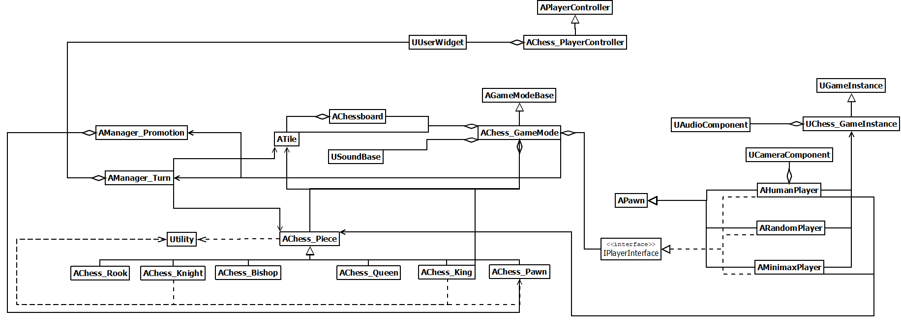
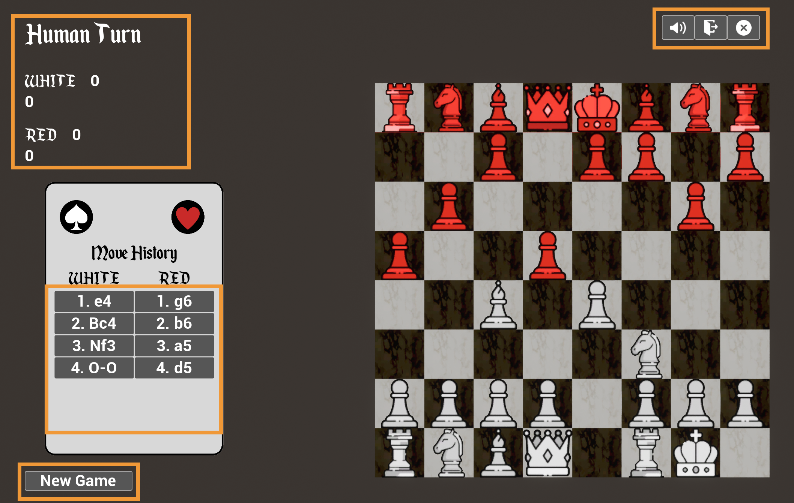
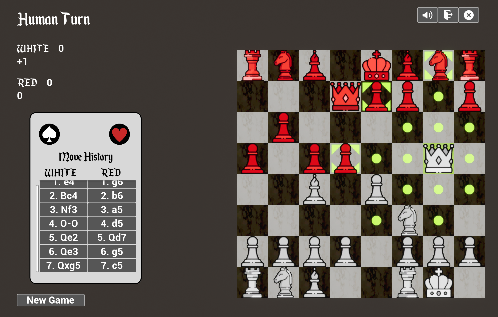
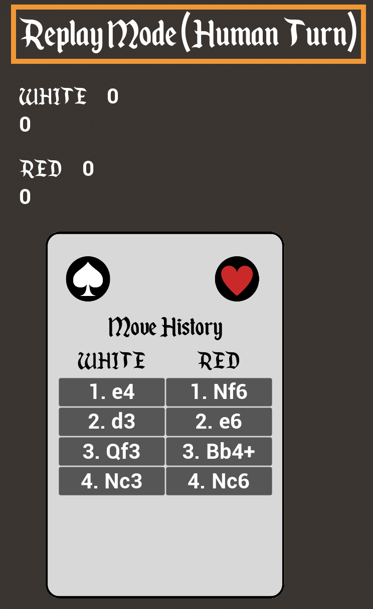
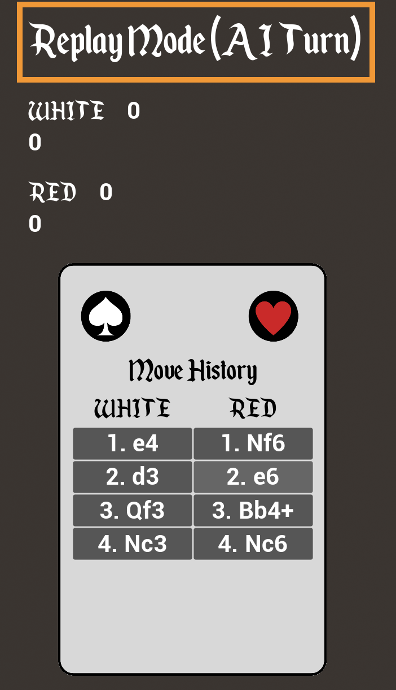

# UE_Chess

Chess game in Unreal Engine 5.2 for a university project of the "Programming and Analysis of Algorithms" course.

## Built with
- Unreal Engine
- Rider (Jet Brains)
- C++
- UE Blueprints (only for UI or where strictly necessary

## Requirements
- Unreal Engine 5.2
- Visual Studio or Rider

## Usage
This is the complete game of chess, the only move not allowed (not yet implemented) is the en passant (pawn promotion and castle are implemented).
It is a single-player game; the human player will only be able to play with the white team and consequently, the AI will always play with the black team.
There are two main difficulties:
Simple, the AI will play with completely random moves
Difficult, the AI will play by evaluating the tree of possible moves, choosing the most convenient and best one.
The replay of the moves made during the game is also implemented, with the possibility of changing one of your moves during your turn.
NB: It is also possible to disable the replay to increase the difficulty.

## For the university course

### UML

### Pieces assets

## Project's insights

### Main menu
From the main menu, you can conveniently start the game with the desired mode or exit the game.
In the settings, you can increase the difficulty by disabling the replay and adding background music.

### Game UI
During the game it will be possible, thanks to the user interface, to view the score of the match, the entire history of the moves made, and various buttons that introduce some additional features.
At the bottom left the "new game" button resets the board making you start the game over again or start a new game if finished (always at the same difficulty)
At the top right, starting from the left, you can disable all sounds, return to the main menu, and exit the game.
NB: the entire UI during the game will only be interactable during your turn.

### Human player
The human player will be assigned the white team by default. The possible moves are displayed on the board based on the piece you want to move.

### Random player
As already mentioned, this is the simplest mode where the AI will play with random moves

### Minimax player
This is the hardest mode.
The intelligent algorithm for this player was implemented through the minimax algorithm with alpha-beta pruning, which evaluates every situation on the board after generating the tree of all possible moves of limited depth.
The evaluation function was created also thanks to some sources found on the web:
- [Link1](https://www.chessprogramming.org/Simplified_Evaluation_Function)
- [Link2](https://stanford-cs221.github.io/autumn2023-extra/modules/games/evaluation-functions-6pp.pdf)

### Move history and replay
The move history can be consulted during the game and shows the player all the moves made up to that point using the official Algebraic Notation used in chess.
By clicking on each move the state of the board is brought back to the moment of the move.
You can only modify your moves, so you will be allowed to continue the game only at a previous time when it was your turn.

<table>
  <tr>
    <td></td>
    <td></td>
  </tr>
</table>

